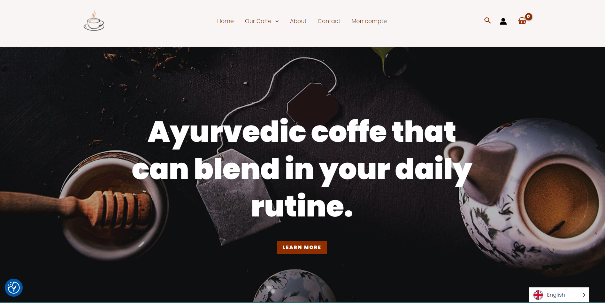
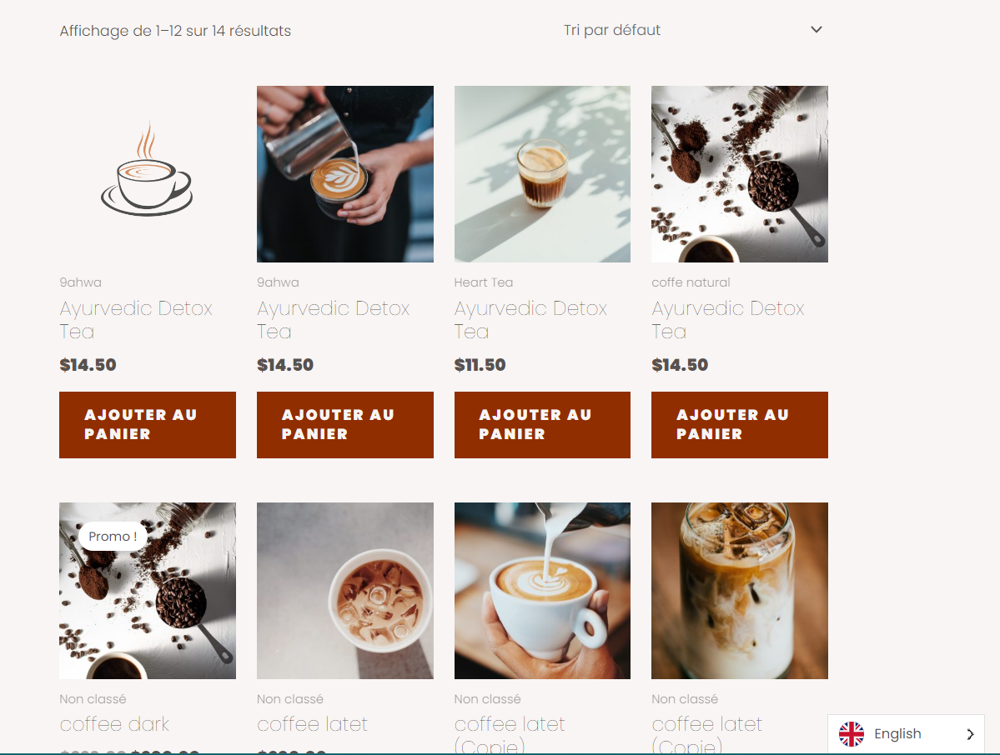
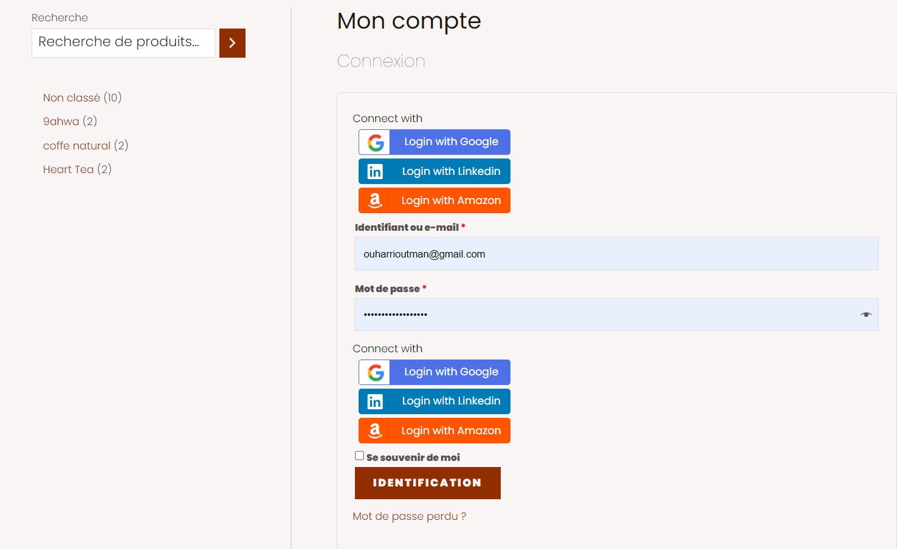
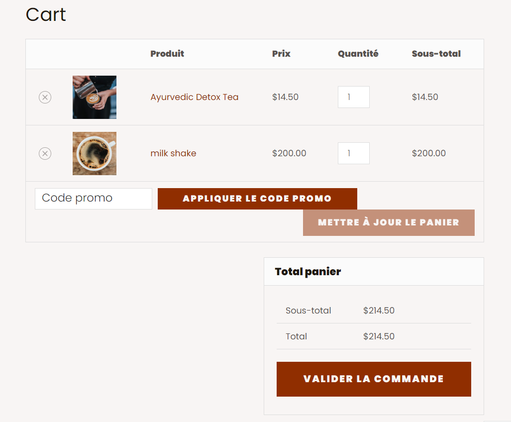

# Cafeine

# site Cafeine

Bonjour, dans ce projet, je vais vous expliquer comment j'ai créé un site e-commerce avec WordPress pour notre shop café. Le site a été conçu pour vendre des machines à café, des ingrédients, des outils et des graines de café. Notre objectif était de créer un site qui reflète l'image de notre marque et qui offre une expérience d'achat facile et agréable à nos clients. Nous avons également travaillé à atteindre un public mondial et à offrir des options de paiement sécurisées pour les transactions en ligne. Tout au long du processus, nous avons suivi des consignes strictes pour assurer la qualité de notre site.

## Installation

1. Tout d'abord, j'ai installé WordPress sur mon serveur local en suivant les étapes d'installation standard.

2. Ensuite, j'ai créé une base de données adéquate et configuré le compte admin.

## Configuration

1. J'ai choisi un thème similaire à celui du site proposé et l'ai installé en téléchargeant le thème depuis un site Web
   de thèmes tiers.

2. J'ai ensuite configuré le thème pour qu'il corresponde davantage au site original en modifiant les sections et les
   pages. J'ai également personnalisé les couleurs, modifié la mise en page et ajouté des widgets en option.

### Pages ajoutées

1. La page d'accueil : C'est la page principale de notre site, où vous pourrez découvrir notre sélection de café, les
   dernières promotions et offres spéciales.

2. Nos cafés : Cette page présente les différentes catégories de café que nous proposons, allant du café moulu, aux
   grains de café entiers et aux dosettes, pour satisfaire tous les goûts et préférences.

3. About : Cette page vous donne des informations sur notre entreprise, notre passion pour le café et notre engagement
   envers la qualité et la durabilité.

4. Contact : Cette page vous permet de nous contacter facilement, que ce soit pour poser des questions, donner des
   commentaires ou des suggestions.

5. Mon compte : Si vous créez un compte sur notre site, vous pourrez accéder à cette page pour consulter vos commandes,
   vos informations de paiement et d'expédition, ainsi que pour gérer votre profil et vos préférences.

6. Le panier : Cette page affiche le récapitulatif de vos achats et vous permet de finaliser votre commande en toute
   simplicité.

Nous espérons que vous trouverez toutes les informations dont vous avez besoin sur notre site et que vous apprécierez
votre expérience de shopping en ligne chez nous !

### Plugins utilisés
Akismet Anti-Spam: Plugin de sécurité pour bloquer les commentaires et les formules de contact indésirables sur votre site WordPress.

All in One SEO Pack: Plugin de référencement pour améliorer la visibilité de votre site dans les moteurs de recherche.

Burger Companion: Plugin pour créer des menus déroulants et des menus burger personnalisés.

CookieYes | GDPR Cookie Consent: Plugin de consentement aux cookies pour se conformer aux réglementations européennes en matière de confidentialité.

GTranslate: Plugin pour traduire automatiquement le contenu de votre site dans plus de 100 langues.

Paiements WooCommerce: Plugin pour accepter les paiements en ligne via WooCommerce.

Social Login: Plugin pour permettre aux utilisateurs de se connecter à votre site avec leurs comptes de réseaux sociaux.

Social Sharing by miniOrange: Plugin pour ajouter des boutons de partage social à votre site.

Spectra: Plugin de sécurité pour détecter et prévenir les attaques malveillantes sur votre site WordPress.

Yoast SEO: Plugin de référencement pour optimiser le contenu et les pages de votre site pour les moteurs de recherche.

### Critères de performance

Pour répondre aux critères de performance, j'ai optimisé le code, les images et utilisé des techniques de mise en cache
pour garantir que le site WordPress se charge rapidement.

1. J'ai également utilisé des thèmes et des plugins légers et optimisés pour améliorer les performances du site, et j'ai
   sécurisé le site en utilisant des plugins de sécurité fiables et en appliquant les mises à jour de sécurité.

2. En outre, j'ai veillé à ce que le site WordPress soit compatible avec les navigateurs modernes et suive les normes du
   web pour améliorer l'accessibilité.

3. J'ai optimisé le site WordPress pour les moteurs de recherche en utilisant des plugins SEO, en rédigeant du contenu
   de qualité et en utilisant des balises méta appropriées.

4. J'ai également utilisé des outils d'analyse de la performance pour surveiller la vitesse de chargement du site, le
   temps de réponse du serveur et le trafic.

5. Enfin, j'ai régulièrement sauvegardé mon site WordPress pour éviter les pertes de données en cas de problème
   technique. J'ai utilisé un CDN pour accélérer le chargement des images et des fichiers statiques de mon site
   WordPress, et j'ai optimisé régulièrement la base de données de mon site en supprimant les tables inutiles et en
   réduisant la taille des tables.

## Github

Pour partager mon travail sur Github, j'ai suivi les étapes suivantes :

1. J'ai créé un nouveau repository sur Github.
2. J'ai cloné le repository sur mon ordinateur en utilisant la commande git clone.
3. J'ai ajouté tous les fichiers de mon site WordPress à mon repository en utilisant la commande git add ..
4. J'ai confirmé mes changements en utilisant la commande git commit -m "premier commit".
5. J'ai envoyé mes changements à Github en utilisant la commande git push.
   Voilà, j'espère que ce guide vous a été utile pour répliquer le site WordPress NYTC et répondre aux critères de
   performance.